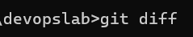

# DevOps-LABFILE

# LAB-1 GIT COMMANDS

git clone https://github.com/adx04/devopslab.git


```bash
git add .
git commit -m "added README"
git push
```


`git status`


`git diff`
()


> Checking the block code 


