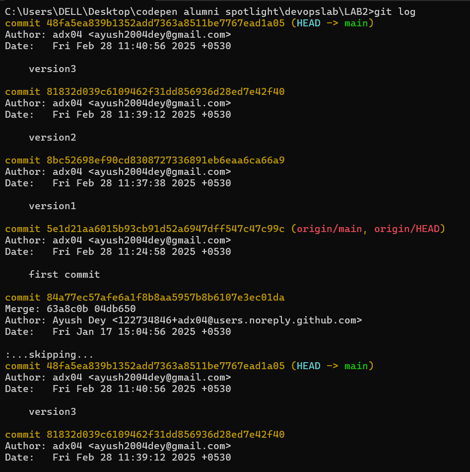

# LAB-2 GIT COMMANDS
*BRANCHING*


Create a file and do 3 commits in it
### 1st change
```bash
git add .
git commit -m "version1"
```


### 2nd change
```bash
git add .
git commit -m "version2"
```


### 3rd change
```bash
git add .
git commit -m "version3"
```


View all commits by using git log

```bash
git log
```



```bash
git branch feature1
git log
```


CREATE NEW FILE AND ADD A COMMIT
```bash
git add.
git commit -m "feature commit 1"
```


switching to master branch and perform merging
```bash
git checkout master
git merge feature1 -m "Merging featutre 1"
git log

```


*RESET*
```bash
git reset --hard a462d13e9a
git log
``` 


*GIT RESET --HARD:Removed the merge commit 13dd279 and deleted all merged changes.*
*GIT RESET --SOFT:Would have removed the merge commit but kept changes staged, allowing you to re-commit easily.*

*REBASE*

```bash
git checkout feature1
git rebase master
git log
``` 


