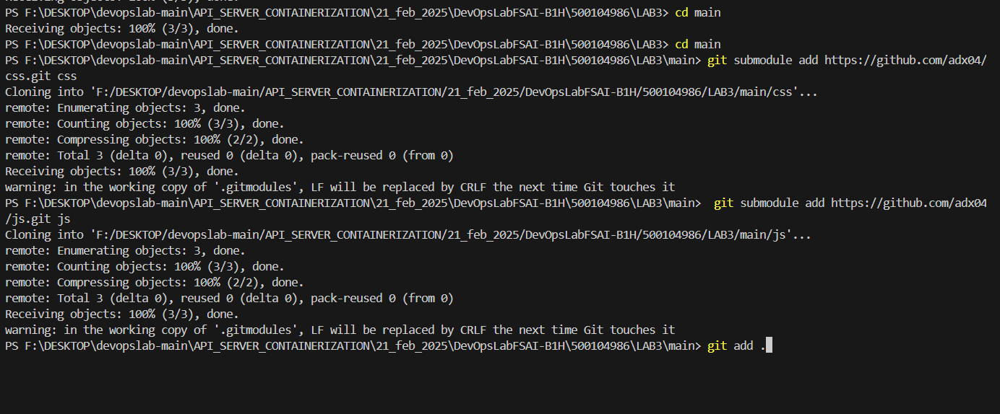
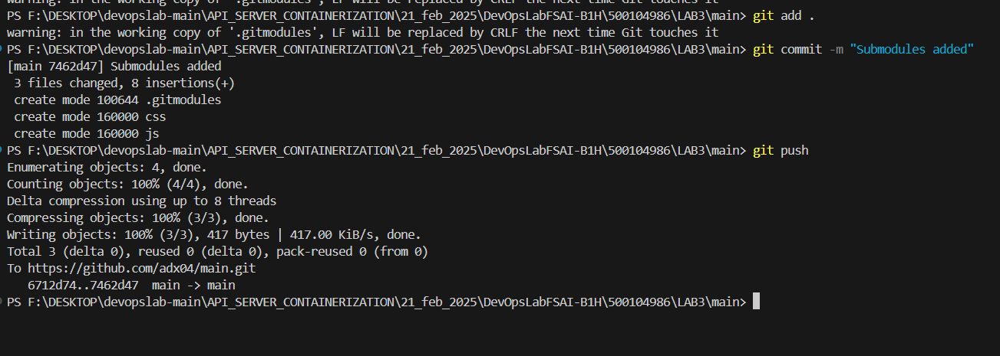
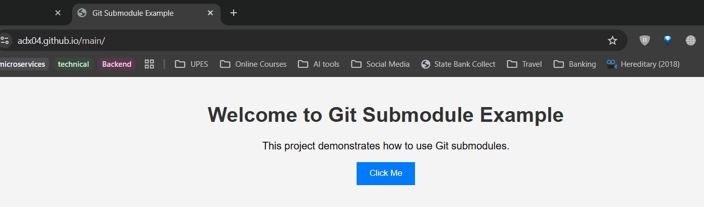
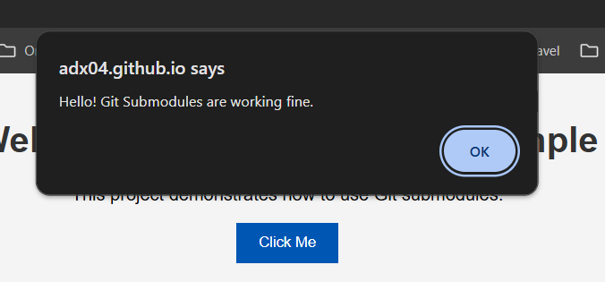

# GIT SUBMODULE LAB

## **Creating and Cloning Repositories**
1. **Create three repositories in GitHub:**
   - **REPO1: MAIN** → Add `index.html`, commit, and push.
   - **REPO2: CSS** → Add `style.css`, commit, and push.
   - **REPO3: JS** → Add `script.js`, commit, and push.

2. **Clone the repositories to your local machine:**
   ```bash
   git clone https://github.com/adx04/main.git
   git clone https://github.com/adx04/css.git
   git clone https://github.com/adx04/js.git
   ```

## **Adding Submodules**
1. Open the **integrated terminal** in the `MAIN` repo.
2. Add the `CSS` and `JS` repositories as submodules:
   ```bash
   git submodule add https://github.com/adx04/css.git css
   git submodule add https://github.com/adx04/js.git js
   git add .
   git commit -m "Submodules added"
   git push
   ```
   
   

## **Hosting on GitHub Pages**
1. **Create a repository** with the same name as your GitHub username:
   ```
   adx04.github.io/main
   ```
2. **Go to repository settings:**
   - Click **Settings** → **Pages**
   - Under "Branch," select `main`.
   - Click **Save**.



---

