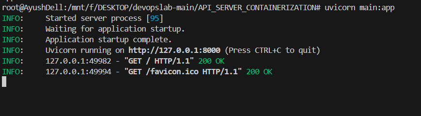
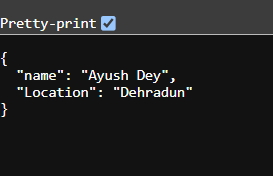
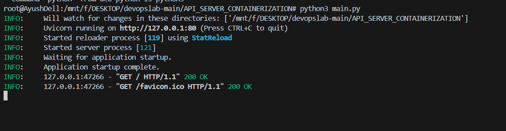

#  FastAPI Dockerization Lab

## 📂 Project Structure

```
/fastapi-docker-lab
│── Dockerfile                 # Docker configuration file
│── main.py                    # FastAPI application
│── requirements.txt            # Dependencies
│── .github/
│   └── workflows/
│       └── automate.yml       # GitHub Actions CI/CD workflow
│── Pipfile                    # (Optional) Pipenv dependencies
```

---


###  **Install Dependencies**
```bash
pip install -r requirements.txt
```

---

##  Dockerization

### 3️⃣ **run the main.py app using uvicorn**
```bash
uvicorn main:app
```


### 4️⃣ **Run the app on dedicated port**
```bash
python3 main.py
```



---

## 🤖 GitHub Actions Workflow

The **`.github/workflows/automate.yml`** file automates building and testing on every push.

### Example Workflow (`automate.yml`):
```yaml
name: FastAPI CI/CD

on:
  push:
    branches:
      - main

jobs:
  build:
    runs-on: ubuntu-latest
    steps:
      - name: Checkout Repository
        uses: actions/checkout@v3

      - name: Set up Python
        uses: actions/setup-python@v3
        with:
          python-version: '3.10'

      - name: Install Dependencies
        run: pip install -r requirements.txt

      - name: Build Docker Image
        run: docker build -t fastapi-app .
```

---

## 📜 API Endpoints (Example)
### **Run FastAPI server:**
```bash
uvicorn main:app --host 0.0.0.0 --port 8000 --reload
```

### **Example FastAPI `main.py`**
```python
from fastapi import FastAPI

app = FastAPI()

@app.get("/")
def home():
    return {"message": "FastAPI with Docker!"}
```

---

## 🎯 Summary
- **Dockerized FastAPI app** ✅
- **GitHub Actions CI/CD workflow** ✅
- **Fully automated build process** ✅

🚀 *You're now ready to deploy your FastAPI app in a Docker container!*  
```

This **README** includes step-by-step **setup, Dockerization, and GitHub Actions automation** instructions. Let me know if you need any modifications! 🚀🔥